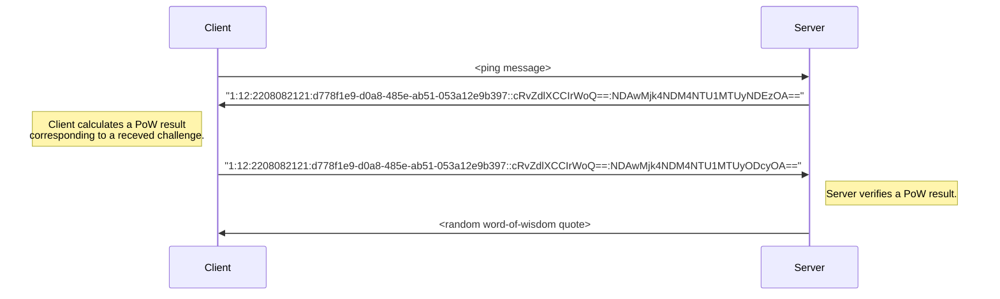

# pow-word-of-wisdom
“Word of Wisdom” TCP server and a client to connect with it. The server is protected from DDOS attacks with the Prof of Work based on Hashcash (over challenge-response protocol).

## PoW
In this implementation we use [Hashcash](https://en.wikipedia.org/wiki/Hashcash) PoW system as the most clearly described jet powerful solution to provide sustainable verification. We use SHA-256 hash function as it is considered cryptographically strong and not allowing collisions to be practically generated in comparison to SHA-1 proposed to be used in Hashcash.

## Workflow
`Client` sends a ping message to `Server` to initiate the flow. `Server` accepts the connection and sends to `Client` a challenge header of format `version:bits:date:source::random:counter` where:
- *version*: Hashcash format version. Must be `1`;
- *bits*: number of leading zero bits in a calculated proof of work. The number of bits is randomly chosen from the interval [10, *complexity*), so it helps to distribute a workload of `Server` naturally and to keep calculation time for each `Client` affordable. The *complexity* can be set in `Server` environment variables;
- *date*: a sting with timestamp of sending the challenge. Must be of format `YYMMDDhhmm`;
- *source*: a string containing random UUID. As long as we cannot determine the resource (e.g. a quote) to access, we are using a random UUID to support calculation complexity;
- *random*: base-64 encoded sequence of 10 random bytes (to support calculation complexity);
- *counter*: base-64 encoded random initial counter value of interval [0, 2^63^).

`Client` receives the challenge and must send back a calculation result -- the initial challenge header with increased counter; the hash of the calculation result contains *bits* number of leading zero bits. If `Client` cannot respond with PoW result within a determined time duration (set in `WAIT_POW` `Server` environment variable), it receives `context done` message, and the flow terminates.
`Server` verifies the received PoW calculation result and responds with a randomly picked word-of-wisdom quote in case the result is correct. If verification fails, `Server` notifies `Client` about failure and terminates the flow.

*The sequence diagram above represents a workflow happy path.*

## How to run
### Tests
- Run unit tests: `go test ./...`
- Check test coverage: `go test -cover ./...`

### Server

    docker-compose up [--build] server

### Client

    docker-compose up [--build] client
**Note**: for the sake of not getting undesirable `Client` termination please run `Client` after `Server` have started.

## Notes

- We must never keep `.env` files in repository. Here it has been done for illustrative purposes.
- I'd rather keep the project structure divided in 4 depending repositories: `logging`, `pow`, `server`, and `client`.

